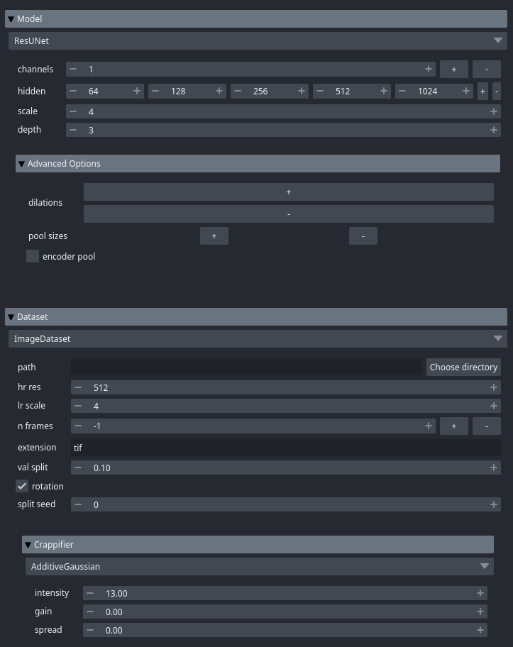
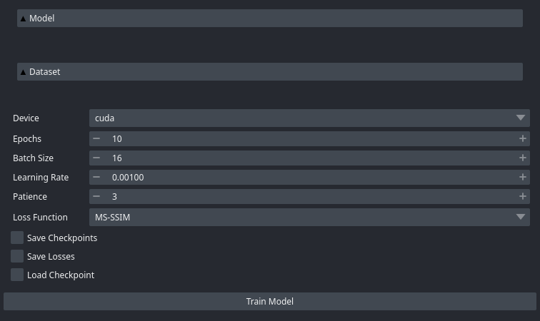
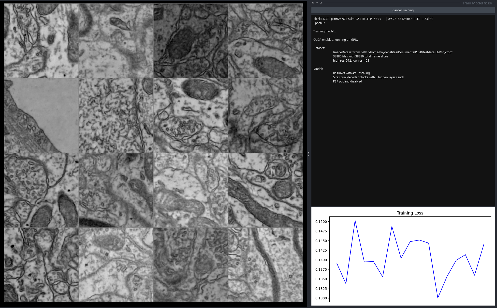

Using Napari
=============

.. note::

   Napari must first be installed to use the **PSSR2** plugin.
   Detailed instructions can be found in the `Napari Documentation <https://napari.org/stable/tutorials/fundamentals/installation.html>`_

Train Model
------------

The **PSSR2** Napari plugin is automatically installed with the rest of the package.
To access the plugin, open Napari and navigate to ``Plugins > PSSR2 > Train Model``.
The training GUI will be visible on the right side of the active Napari window.

The **PSSR2** Napari plugin is similar to the **PSSR2** :doc:`../reference/CLI`,
in that it exposes package features and object parameters in an easily accessible format,
and shares much of the same functionality.
All features included in the :doc:`../reference/CLI` are also included in the Napari plugin.

:doc:`Datasets <../reference/data>` and :doc:`../reference/models` are defined under their respective dropdown menus.
Here, the type of each object can be selected along with the parameters of the object.
The :doc:`API Reference <../reference/api>` can be consulted for full documentation on all parameters.

Different parameters types are edited in different ways.
For example, the number of elements in a list can be increased or decreased with the rightmost buttons,
while the values in the list can be increased or decreased with their respective buttons:

Options for training can also be defined, such as the training device, batch size, and loss function.
By selecting ``Save Checkpoints`` or ``Save Losses``,
model checkpoints or training losses will be saved at the end of every epoch.
By selecting ``Load Checkpoint``, training can be resumed from a model checkpoint.
By default, everything is saved in the folder that Napari was launched from:

After properly defining all objects and options, the model can then be trained by selecting ``Train Model``:

The training objects/parameters will be replaced by a read-only console, similar to that in the :doc:`../reference/CLI`,
showing the status of model training over time.

The performance of the model can be monitored via the Napari viewer.
There are three viewer layers:

- **HR** (ground truth high-resolution images)
- **PSSR** (PSSR super-resolution model predictions)
- **LR** (crappified low-resolution images)

Each viewer layer contains all of the images of their respective quality, updated every 50 iterations.
There is also a plot of training losses where new points are plotted at the same frequency.

When model training has completed, the trained model will be saved.

Predict Images
---------------

To super-resolve images using a trained model from the previous step,
open Napari and navigate to ``Plugins > PSSR2 > Predict Images``.
The predict GUI will be visible on the right side of the active Napari window.

The :doc:`dataset <../reference/data>` and :doc:`model <../reference/models>` objects will be visible again.
The dataset should now be defined with the low-resolution images to be super-resolved.
The model must have the same settings as the trained model to be properly loaded.

After entering the path to the trained model, the given low-resolution images can be super-resolved by selecting ``Predict Images``.
The predicted images will then be saved to the ``preds`` folder relative to where Napari was launched from.
